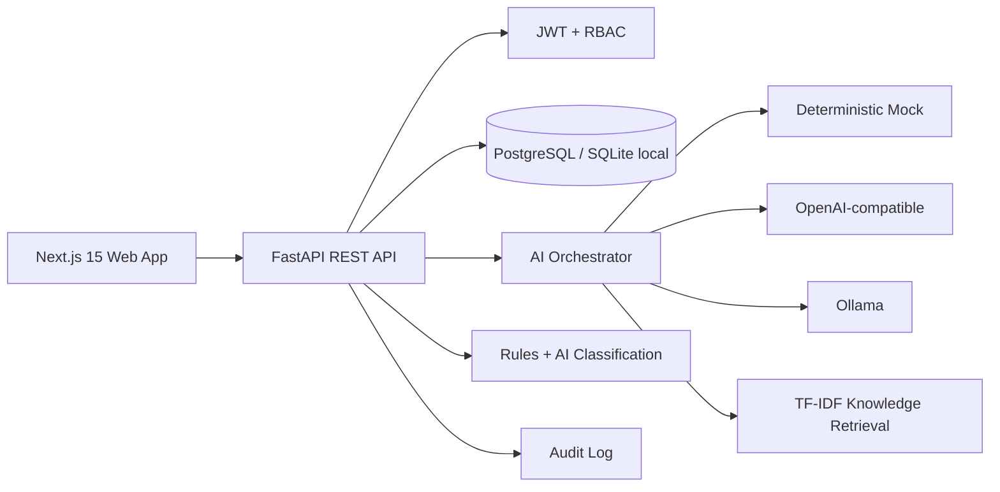

# JourneySync AI

JourneySync AI is a hackathon-ready omnichannel customer experience prototype. It unifies customer interactions across web chat, email, mobile, social, and in-store support into a single agent workspace with AI analysis, knowledge retrieval, routing, auditability, and calculated CX metrics.

> Demo credentials are for local demonstration only.

| Role | Email | Password |
| --- | --- | --- |
| Administrator | admin@journeysync.demo | Admin123! |
| Support Agent | agent@journeysync.demo | Agent123! |
| Demo Customer | customer@journeysync.demo | Customer123! |

## Quick Start

```bash
cp .env.example .env
docker compose up --build
```

Frontend: http://localhost:3000  
Backend API: http://localhost:8000  
FastAPI docs: http://localhost:8000/docs

Local backend without Docker:

```bash
cd apps/api
py -m venv .venv
.\.venv\Scripts\pip install -r requirements.txt
set DATABASE_URL=sqlite:///./journeysync.db
set AI_PROVIDER=mock
.\.venv\Scripts\python -m app.seed
.\.venv\Scripts\uvicorn app.main:app --reload
```

Local frontend:

```bash
cd apps/web
npm.cmd install
npm.cmd run dev
```

## Architecture



## Features

- Role-based demo login for administrator, support agent, and customer.
- Executive dashboard with metrics calculated from seeded tickets, messages, suggestions, and sentiment records.
- Unified inbox with search, channel, sentiment, priority, and assignment filters.
- Three-column agent workspace with conversation history, editable AI suggestion, retrieved sources, routing recommendation, approval/rejection controls, escalation, and resolution.
- Customer 360 profile, journey map, analytics, knowledge base CRUD/search/re-indexing, routing rules, audit/AI transparency, and customer chat simulator.
- Omnichannel adapters normalize simulated web chat, email, mobile app, social, and in-store interactions.
- Mock AI mode works without keys; OpenAI-compatible and Ollama providers are included with deterministic mock fallback.
- RAG fallback uses keyword/TF-IDF-style scoring and stores chunks in the database.
- Guided demo scenario creates the damaged-delivery escalation flow and records AI and human actions.

## AI And RAG Workflow

1. Incoming messages are normalized by channel adapters.
2. The AI service classifies intent, sentiment, urgency, churn explanation, department, next best action, and confidence.
3. Knowledge documents are chunked and scored with a local token-overlap/IDF-inspired retriever.
4. Retrieved sources are attached to AI suggestions and displayed to agents.
5. Agents must approve, edit, or reject AI suggestions before sending.
6. Every AI and human decision is written to the audit log.

The UI labels generated text as an AI-generated suggestion and shows a human-verification disclaimer. The system does not claim AI outputs are guaranteed.

### Live AI Providers

The default is still safe offline mode:

```bash
AI_PROVIDER=mock
```

To test with local Ollama:

```bash
AI_PROVIDER=ollama
OLLAMA_BASE_URL=http://127.0.0.1:11434
OLLAMA_MODEL=mistral
```

The backend calls Ollama at `/api/chat`, requests strict JSON, validates the result with Pydantic, and falls back to mock AI if Ollama is unavailable or returns malformed output. OpenAI-compatible APIs use the same validation path with `OPENAI_BASE_URL`, `OPENAI_API_KEY`, and `OPENAI_MODEL`.

## Data Model Overview

The backend defines SQLAlchemy models for users, organizations, customers, profiles, channels, conversations, messages, support tickets, assignments, knowledge documents/chunks, AI suggestions, sentiment records, customer metrics, audit logs, routing rules, and notifications. UUID primary keys and timestamps are used throughout.

## Security

- Passwords are hashed with passlib bcrypt.
- JWT access tokens protect API routes.
- Role-based dependencies restrict administrator and agent actions.
- CORS is environment-configured.
- AI endpoints use simple in-memory rate limiting for prototype safety.
- Secrets are read from environment variables and are not committed.

## Common Commands

```bash
make install
make dev
make test
make lint
make seed
make reset-demo
make docker-up
make docker-down
```

## Testing

Backend:

```bash
cd apps/api
py -m pytest
```

Frontend:

```bash
cd apps/web
npm.cmd test
npm.cmd run e2e
```

## Demo Walkthrough

1. Log in as `agent@journeysync.demo`.
2. Open the Agent Workspace.
3. Choose the high-priority damaged delivery conversation.
4. Review detected negative sentiment, high urgency, retrieved damaged-order sources, and routing to Logistics and Returns.
5. Edit the AI-generated response and approve/send it.
6. Open Audit & AI Transparency to see the approval record.
7. Use Run Demo Scenario to recreate the end-to-end flow from web delay to email damaged-product escalation.

## Screenshots

Run the app and capture the dashboard, agent workspace, customer 360, and simulator for submission materials.

## Known Limitations

- External email/social/mobile integrations are simulated by adapters.
- The default retriever is local keyword similarity so the app works offline.
- OpenAI-compatible and Ollama modes are implemented with validated JSON output and automatic mock fallback.

## Future Improvements

- Add pgvector and sentence-transformer embeddings for production retrieval.
- Add real connector credentials and webhook verification.
- Expand workflow automation, SLAs, and enterprise SSO.
- Add streaming AI responses and richer observability.

## Hackathon Success Metrics

JourneySync AI demonstrates faster agent context gathering, explainable AI suggestions, omnichannel continuity, measurable CX outcomes, and safe human-in-the-loop automation.
