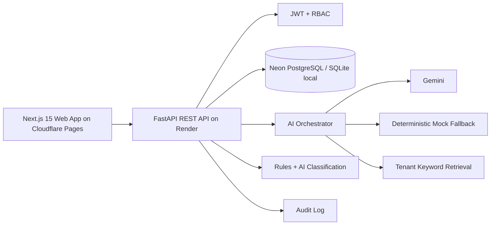

# JourneySync AI

JourneySync AI is a hackathon-ready omnichannel customer experience prototype. It unifies customer interactions across web chat, email, mobile, social, and in-store support into a single agent workspace with AI analysis, knowledge retrieval, routing, auditability, and calculated CX metrics.

> Demo credentials are for local demonstration only.

| Role | Email | Password |
| --- | --- | --- |
| Administrator | admin@journeysync.demo | Admin123! |
| Support Agent | agent@journeysync.demo | Agent123! |
| Demo Customer | customer@journeysync.demo | Customer123! |

## Quick Start

```bash
cp .env.example .env
docker compose up --build
```

Frontend: http://localhost:3000  
Backend API: http://localhost:8000  
FastAPI docs: http://localhost:8000/docs

Live frontend URL: Cloudflare Pages deployment URL placeholder.  
Backend readiness: `/ready` on the Render FastAPI service.  
Deployment notes and the production readiness checklist live in [docs/deployment.md](docs/deployment.md). The enterprise SaaS rebuild roadmap lives in [docs/enterprise-saas-roadmap.md](docs/enterprise-saas-roadmap.md). Start production environment configuration from `.env.production.example`.

Local backend without Docker:

```bash
cd apps/api
py -m venv .venv
.\.venv\Scripts\pip install -r requirements.txt
set DATABASE_URL=sqlite:///./journeysync.db
set AI_PROVIDER=mock
.\.venv\Scripts\python -m app.seed
.\.venv\Scripts\uvicorn app.main:app --reload
```

Local frontend:

```bash
cd apps/web
npm.cmd install
npm.cmd run dev
```

## Architecture



## Features

- Role-based demo login for administrator, support agent, and customer.
- Executive dashboard with metrics calculated from seeded tickets, messages, suggestions, and sentiment records.
- Unified inbox with search, channel, sentiment, priority, and assignment filters.
- Three-column agent workspace with conversation history, editable AI suggestion, retrieved sources, routing recommendation, approval/rejection controls, escalation, and resolution.
- Customer 360 profile, journey map, analytics, knowledge base CRUD/search/re-indexing, routing rules, audit/AI transparency, and customer chat simulator.
- Omnichannel adapters normalize simulated web chat, email, mobile app, social, and in-store interactions.
- Gemini is the primary live AI provider; deterministic mock fallback works without keys and covers provider errors, malformed output, timeout, and test mode.
- Knowledge retrieval uses tenant-scoped keyword/IDF-style chunk scoring and stores chunks in the database. It does not claim embeddings or vector search.
- Guided demo scenario creates the damaged-delivery escalation flow and records AI and human actions.

## AI And RAG Workflow

1. Incoming messages are normalized by channel adapters.
2. The AI orchestration service assembles selected conversation context, broader customer timeline, ticket state, and tenant-scoped knowledge candidates.
3. Gemini or deterministic fallback returns validated structured JSON: intent, sentiment, urgency, repeat-contact signal, summaries, recommended team, routing reason, next-best action, suggested reply, knowledge sources, confidence, and fallback status.
4. Knowledge documents are chunked and scored with a local token-overlap/IDF-inspired retriever.
5. Retrieved sources are attached to AI suggestions and displayed to agents.
6. Agents must approve, edit, reject, assign, escalate, resolve, or reopen; the AI does not send autonomously.
7. Every AI and human decision is written to the tenant-scoped audit log.

The UI labels generated text as an AI-generated suggestion and shows a human-verification disclaimer. The system does not claim AI outputs are guaranteed.

### Live AI Providers

The default is still safe offline mode:

```bash
AI_PROVIDER=mock
```

Set `AI_PROVIDER=gemini` and configure `GEMINI_API_KEY` only on the backend service. The backend requests strict JSON from Gemini, validates the result with Pydantic, and falls back to mock AI if Gemini is unavailable, rate-limited, times out, returns malformed output, or is not configured.

## Demo Data And Tenant Isolation

Production signup with `SEED_DEMO_DATA=false` creates only an organization, default workspace, administrator account, and tenant-scoped access context. It does not automatically load sample customers. In the Agent Workspace, use **Load Sample Data** to create a fictional, clearly marked sample tenant dataset for the signed-in organization. The guided scenario also loads that fictional data for the active tenant if needed.

Tenant isolation is enforced by organization filters on customers, conversations, tickets, knowledge, analytics, audit, and AI context assembly. Direct API calls for another tenant's records return `404` or tenant-local results only.

## Data Model Overview

The backend defines SQLAlchemy models for users, organizations, customers, profiles, channels, conversations, messages, support tickets, assignments, knowledge documents/chunks, AI suggestions, sentiment records, customer metrics, audit logs, routing rules, and notifications. UUID primary keys and timestamps are used throughout.

## Security

- Passwords are hashed with passlib bcrypt.
- JWT access tokens protect API routes.
- Role-based dependencies restrict administrator and agent actions.
- CORS is environment-configured.
- Production mode refuses demo JWT secrets, SQLite databases, and demo seed data.
- AI endpoints use simple in-memory rate limiting for prototype safety.
- Secrets are read from environment variables and are not committed.

## Common Commands

```bash
make install
make dev
make test
make lint
make seed
make reset-demo
make docker-up
make docker-down
```

## Testing

Backend:

```bash
cd apps/api
py -m pytest
```

Frontend:

```bash
cd apps/web
npm.cmd test
npm.cmd run e2e
```

## 5-Minute Prototype Demonstration

1. Open the Cloudflare Pages frontend and sign up for a new organization, or sign in locally with `agent@journeysync.demo`.
2. Open Agent Workspace and click **Load Sample Data** if the workspace is empty.
3. Select Ari Vale's delayed-delivery case and point out the unified timeline across web chat, email, mobile app, and support desk.
4. Review the AI Decision Panel: intent, sentiment, urgency, repeat-contact signal, Gemini/fallback status, route explanation, next-best action, and visible knowledge sources.
5. Edit the suggested reply, assign Delivery or Escalations, mark high priority, approve the reply, and resolve or reopen the ticket.
6. Open Audit & AI Transparency to show AI classifications, referenced knowledge, and human approval/action records.
7. Open Analytics to show tenant-scoped first response time, resolution time, escalation rate, repeat-contact rate, sentiment trend, channel performance, and ticket status distribution.

## Screenshots

Run the app and capture the dashboard, agent workspace, customer 360, and simulator for submission materials.

## Known Limitations

- External email/social/mobile integrations are simulated by adapters.
- The default retriever is local keyword similarity so the app works offline.
- Gemini mode is implemented with validated JSON output and automatic mock fallback.

## Future Improvements

- Add pgvector and sentence-transformer embeddings for production retrieval.
- Add real connector credentials and webhook verification.
- Expand workflow automation, SLAs, and enterprise SSO.
- Add streaming AI responses and richer observability.

## Hackathon Success Metrics

JourneySync AI demonstrates faster agent context gathering, explainable AI suggestions, omnichannel continuity, measurable CX outcomes, and safe human-in-the-loop automation.
